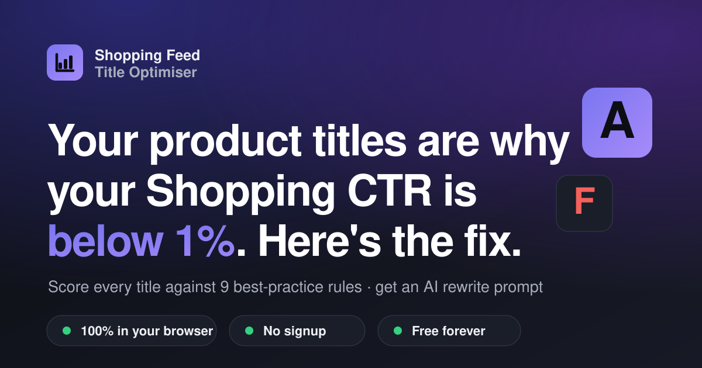

# Shopping Feed Title Optimiser

**Your product titles are why your Shopping CTR is below 1%. Here's the fix.**

A free, no-signup, 100% browser-based tool for Google Shopping and Performance Max
managers. Paste product titles or drop in a Merchant Center feed — the tool scores
every title against nine best-practice rules, surfaces the worst offenders, lets you
download a scored feed, and generates a ready-to-paste AI prompt for bulk rewriting.

**Live:** https://starblank22.github.io/shopping-feed-title-optimiser/

Everything runs client-side. No backend, no upload, no tracking — your feed never
leaves your browser tab.

---

## Screenshot

<!-- Replace with a real screenshot once deployed: -->

---

## What it does

- **Two input modes** — paste titles one per line (with optional brand names), or
  upload a Google Merchant Center feed as CSV, TSV or XLSX.
- **Auto column mapping** — detects `title`, `brand`, `gtin`, `custom_label_0-4` and
  more. If the title column can't be found, a mapping UI lets you pick it.
- **Scoring engine** — every title gets a 0–100 score and an A–F grade, with a
  per-rule pass/fail breakdown and plain-English fixes.
- **Summary dashboard** — average score, grade distribution chart, the most common
  problems across the feed, and an opportunity statement.
- **Sortable / filterable table** — worst titles first, filter by grade, search by
  text, click any row to expand the full rule breakdown and suggested rewrite pattern.
- **Download scored CSV** — original columns plus `feed_score`, `feed_grade`,
  `feed_issues`, `feed_suggested_pattern`.
- **AI rewrite prompt** — generates a senior-grade prompt embedding your worst N
  titles, ready to paste into Claude, ChatGPT or Gemini.

A realistic 50-row sample feed lives at [`assets/sample-feed.csv`](assets/sample-feed.csv)
so you can try the tool immediately.

---

## Scoring rubric

Each title is scored 0–100. Active rules are normalised to sum to 100 — so in paste
mode (no GTIN / custom-label data) the remaining rules absorb that weight
proportionally. Grades: **A** 90+, **B** 75+, **C** 60+, **D** 40+, **F** below 40.

| Rule | Weight | What it checks |
|------|--------|----------------|
| Length 70–150 characters | 15 | Under 70 wastes Shopping space; over 150 is truncated by Google. |
| Brand in first 70 characters | 20 | The brand string must appear before the truncation point (scored only when a brand is supplied). |
| Front-loaded structure | 20 | Brand → Range/Model → Spec → Size: brand in the first 25%, a size/quantity token present, bonus if the size sits near the end. |
| No promotional language | 15 | Flags *sale, free shipping/delivery, discount, % off, best, cheap, buy now, new, hot, limited, clearance, offer, bargain, bestseller, top rated, ★, !* and ALL-CAPS words. |
| No ALL-CAPS words (4+ letters) | 5 | A lighter, separate penalty for shouting. Common acronyms (HDMI, OLED, etc.) and the supplied brand are whitelisted. |
| No duplicate words | 5 | Tokenises the title and flags repeated words, ignoring stopwords. |
| No special-character spam | 5 | Flags `||`, `>>>`, `~~`, repeated hyphens and similar clutter. |
| Valid GTIN present | 10 | *Feed mode only.* Flags empty / zero / N/A / non-standard GTINs. |
| At least one custom label populated | 5 | *Feed mode only.* Custom labels enable bid segmentation. |

The GTIN and custom-label rules only apply in feed mode when those columns exist; in
paste mode their combined 15 points are redistributed across the other rules.

---

## Tech

No build step. Plain `index.html` + `styles.css` + `app.js` served straight from the
repo root by GitHub Pages.

- Vanilla JavaScript — no framework, no bundler.
- [PapaParse](https://www.papaparse.com/) (CSV/TSV) and
  [SheetJS](https://sheetjs.com/) (XLSX) are loaded lazily from a CDN, only when you
  actually parse a file. The initial page load ships zero third-party JavaScript.
- All scoring, parsing and exporting happens in your browser. The only network
  requests are the page assets and (on demand) the two parser libraries.

---

## Deploy your own fork

1. **Fork or copy** this repo into your own GitHub account.
2. The site is static — no build needed. The `.nojekyll` file tells GitHub Pages to
   serve the files as-is.
3. In your repo: **Settings → Pages → Build and deployment**, set **Source** to
   *Deploy from a branch*, branch **main**, folder **/ (root)**, then **Save**.
4. Your site goes live at `https://<your-username>.github.io/<repo-name>/`.
5. Update the absolute URLs in the `<head>` of `index.html` (canonical + Open Graph +
   Twitter tags) to match your own domain so link previews resolve correctly.

To run it locally, serve the folder with any static server (e.g. `python -m http.server`)
— opening `index.html` directly via `file://` works too, except the "Load sample feed"
button, which needs an HTTP origin to `fetch()` the CSV.

---

## Credit

Built by **Shaun Mooney**. Free forever. Runs entirely in your browser — your data
never leaves your device.

Released under the [MIT License](LICENSE).
